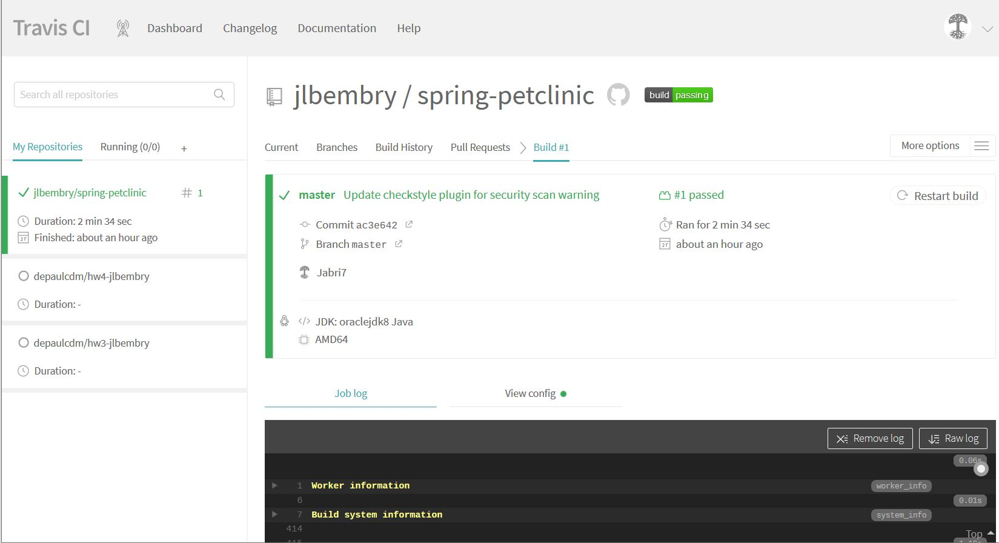
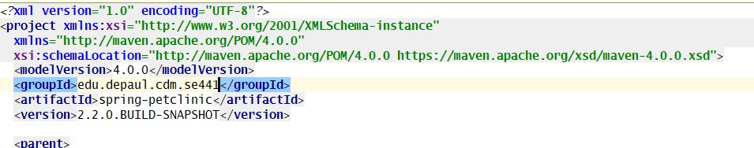
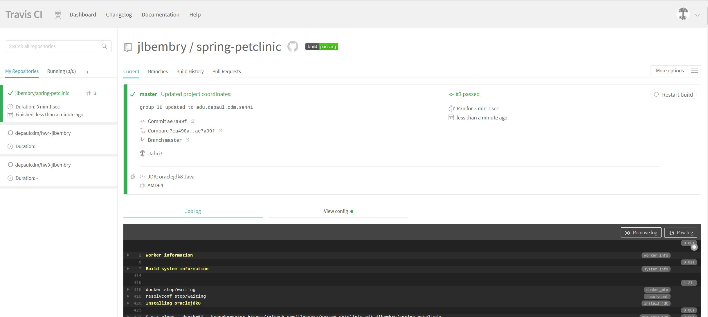
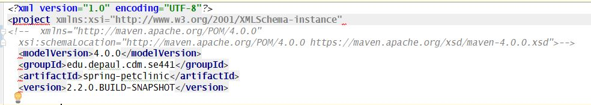
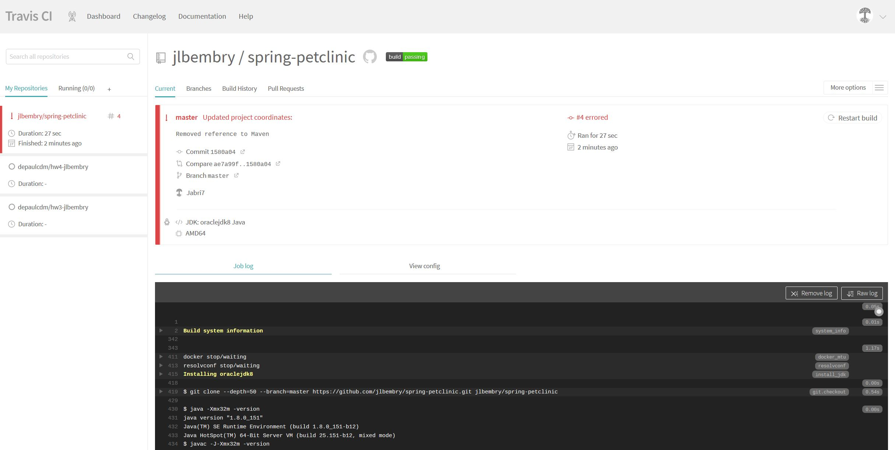
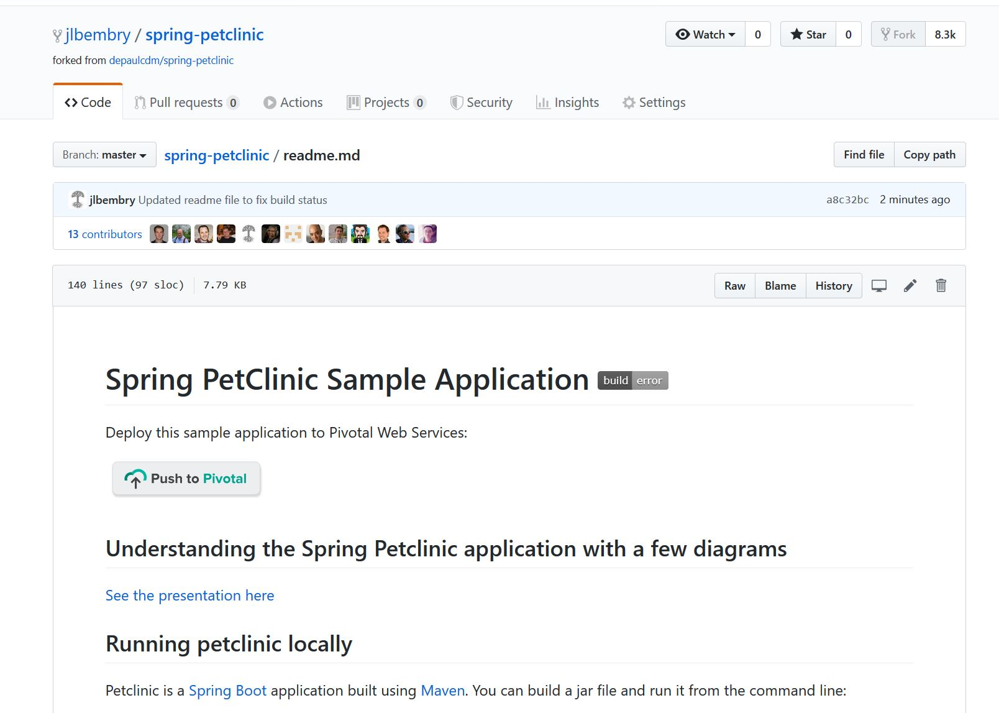
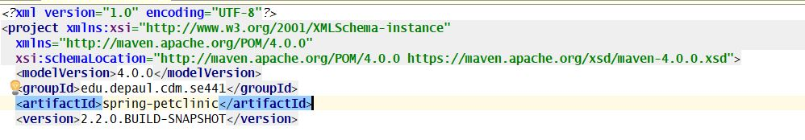
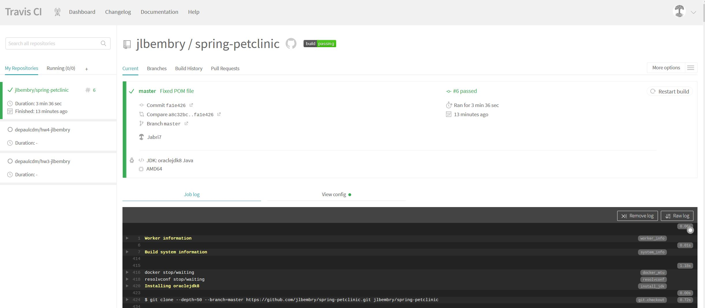
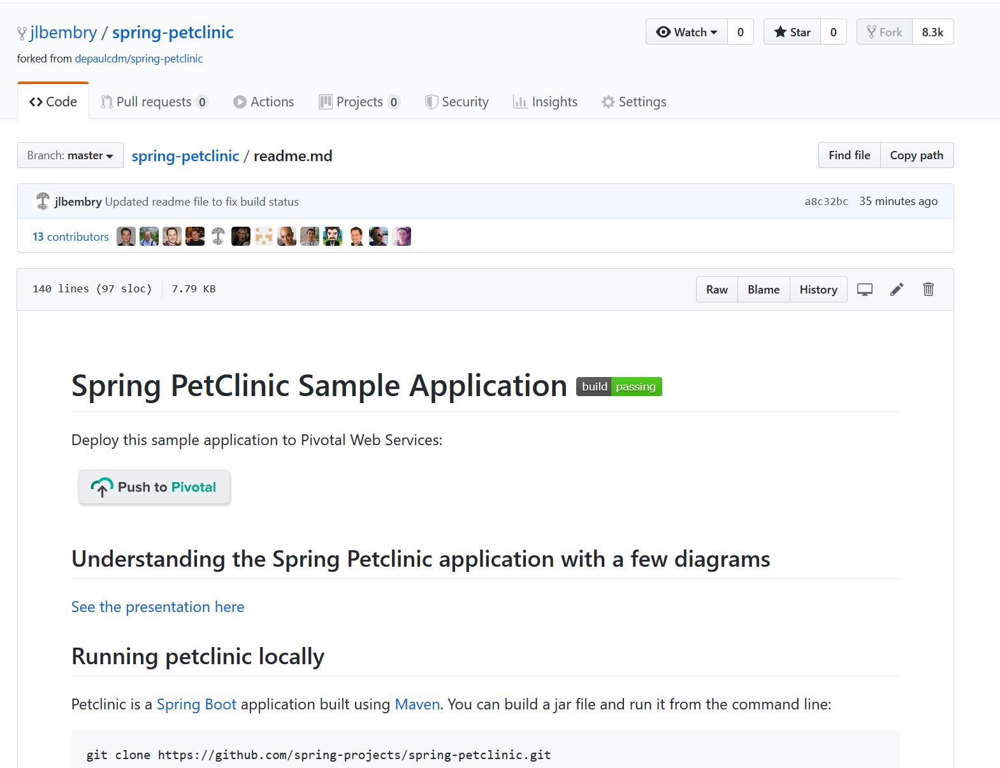

# Deliverables - Homework 5

Jabri Bembry - ID 1881423

-  Github account showing that is has been forked from the depaulcdm/springpetclinic
repository.

   
   

- Travis CI dashboard displaying successful first build

  

- POM file showing groupID changed to edu.depaul.cdm.se441

  
  
  

- Travis CI dashboard build after group ID change

   
   
   

- POM file showing showing coordinates that have been commented out

   
   
   
   
- Travis CI dashboard failed build after modification

     
   
   
   
- Githib repository readme.md showing failed status

     
   
   
   
- POM file showing coordinates that have been restored

     
    
    

- Travis CI dashboard successful build after modification revoked

    
   
    
   
- Githib repository readme.md showing failed status

     
